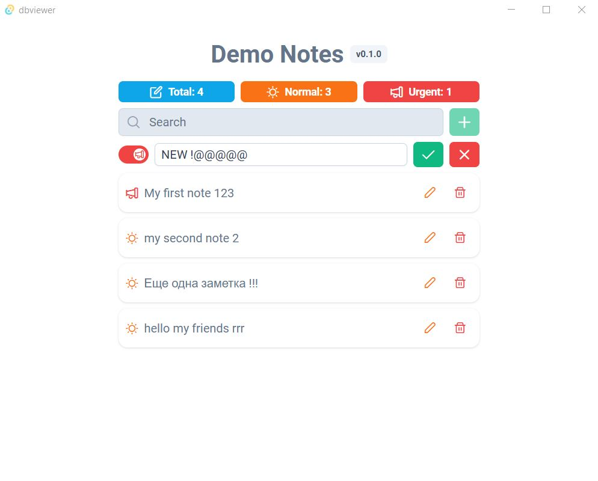

# DBviewer

## Overview 
This project is designed for saving and displaying notes. It uses a PostgreSQL database for data storage. To run the application, you need to set up the environment by launching two servers: a database server and an application server for update. Both servers can be started using docker-compose.

### Requirements:
- PostgreSQL - The application connects to the database and adds/removes records from it.
- Update Server - The application stores the MSI file with the updated version of the application.


## Installation
All of this can be set up using Docker Compose. Make sure that Docker is installed and running correctly on your device (https://docs.docker.com/desktop/setup/install/windows-install).


From project source folder, run the following command:
```
docker-compose up -d  
```
This will launch the necessary servers for the application (simulating access to the database and update server in the cloud).

To stop the running servers, use:
```
docker-compose down
```

# Running the Application
After starting the necessary servers, install the MSI file from the source code folder.

# Technical information for development


### Build and start app
```
npm run tauri dev
```

### Create install package
At first need add some enviroment 

mac/linux 
``` 
export TAURI_SIGNING_PRIVATE_KEY="Path or content of your private key"
# optionally also add a password
export TAURI_SIGNING_PRIVATE_KEY_PASSWORD=""
```

windows 
```
$env:TAURI_SIGNING_PRIVATE_KEY="Path or content of your private key"
<# optionally also add a password #>
$env:TAURI_SIGNING_PRIVATE_KEY_PASSWORD=""
```

build command 
```
npm run tauri build 
```

Main App            |   Insert Note
:-------------------------:|:-------------------------:
  |  
